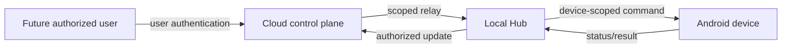

# Cloud Mode

Cloud Mode is a future, optional extension for remote access. It is documentation only: this repository currently contains no cloud relay, user-login flow, remote dashboard, or Android SignalR runtime.

## Intended relationship

```text
Android devices ───────┐
                      │ local-first operation
Local Hub ─────────────┘
      │
      │ outbound, authenticated, opt-in connection
      ▼
Cloud relay / control plane
      │
      ▼
Future remote web or mobile client
```

Cloud Mode should provide a controlled path for remote device status and commands while the Local Hub remains authoritative for its local deployment. It must not be required for LAN registration, recording, or monitoring.

## Future capabilities

- Authenticated remote access across network boundaries.
- Connection routing and presence for registered devices or Local Hubs.
- SignalR-based real-time status and command transport where appropriate.
- A future web dashboard for authorized operators.
- Optional event or metadata synchronization under explicit retention policies.

Live streaming, cloud upload, notifications, billing, pairing, and user authentication require separate architecture and security milestones.

## Trust boundaries

Cloud Mode introduces identities beyond a device installation: users, operators, deployments, and possibly Local Hub instances. Device registration credentials must not be repurposed as user credentials. Authorization must be device-scoped and deployment-scoped, with auditable command origin and correlation IDs.



## Required design work before implementation

1. Define user, tenant/deployment, and Local Hub identity models.
2. Choose outbound relay and connection ownership semantics.
3. Specify pairing and credential rotation independently of v1 registration.
4. Define offline delivery, ordering, expiry, retry, and acknowledgement rules.
5. Establish data minimization, retention, audit, and incident-response policies.
6. Threat-model remote commands and dashboard access.
7. Preserve a fully functional no-cloud mode.
