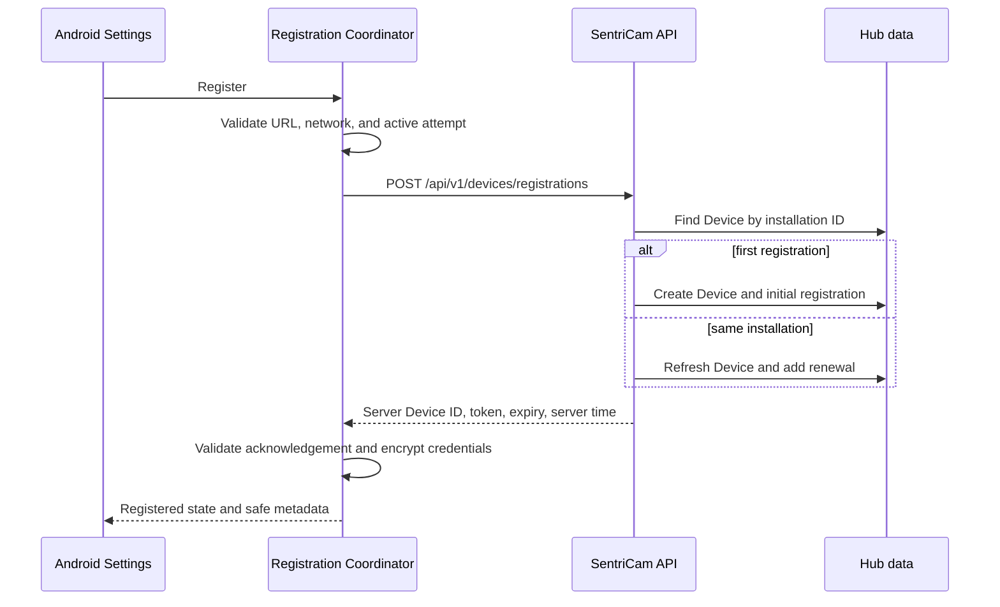

# Device registration

Device registration establishes a server Device and returns device-scoped access credentials without introducing user login. v0.3.0 adds a one-time QR pairing route that delegates to this same registration capability.

## Flow

## Identity contract

The request contains the stable installation UUID, friendly name, Android/app versions, manufacturer/model, API level, stable supported capabilities, client UTC time, and registration schema version. It must not contain privileged or advertising identifiers.

The response contains the separate server Device ID, installation-ID acknowledgement, access token and expiry, server UTC time, registration state, and schema version. Nullable refresh-token fields reserve contract space only; there is no refresh endpoint or working refresh flow.

## Idempotency

The server resolves a Device by the stable installation ID. Repeating registration for the same installation refreshes mutable metadata and capabilities, records a renewal, and returns the same server Device identity. Database uniqueness protects the installation identity.

## Android state and safety

The typed state machine covers Unregistered, Configuring, Registering, Registered, TokenExpired, ConnectionFailed, ServerRejected, InvalidConfiguration, and Error. A mutex suppresses duplicate concurrent calls, generation IDs prevent stale results from overwriting newer state, and cancellation restores safe state.

Credentials survive restart through encrypted storage. Changing the server URL clears credentials tied to the previous server. Forget Registration cancels the active attempt and clears encrypted credentials without changing the local DeviceIdentity.

Automatic registration is conservative: it is bounded, requires network and valid configuration, and occurs only for an installation with an established but expired registration. There is no infinite Activity-recreation retry loop.

## Security

- Raw tokens are not displayed or logged.
- Logs contain only safe attempt, host, status, failure-code, and optional server Device ID metadata.
- Debug HTTP is explicitly isolated to debug builds.
- Release builds require HTTPS in manifest and application policy.
- Server exceptions are mapped to bounded, user-safe failures.
- Home setup generates and protects Hub credentials automatically.
- QR sessions are short-lived, one-use, and do not contain a device access token.
